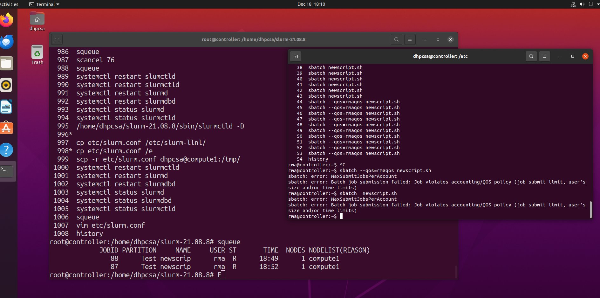
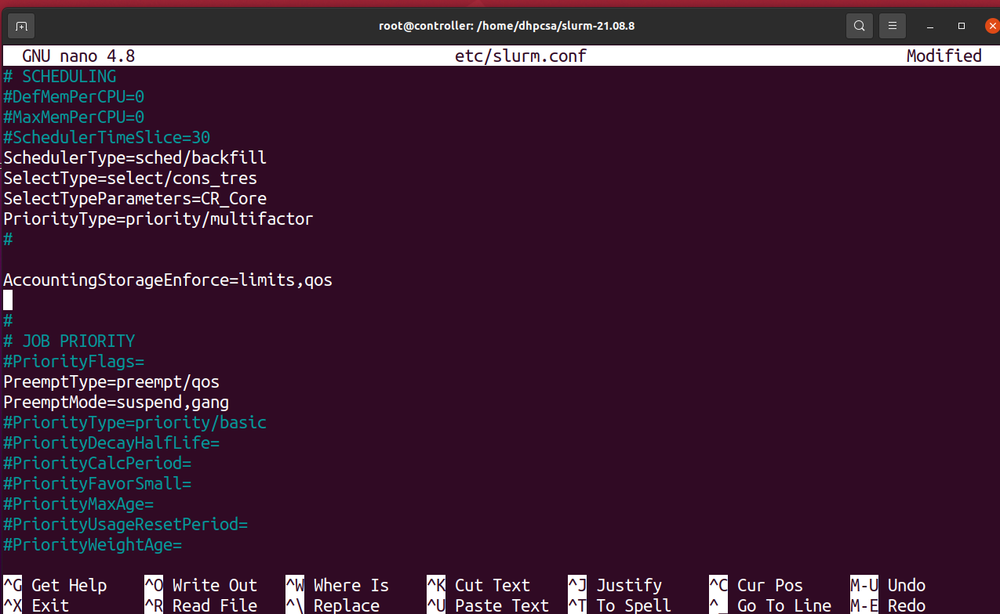
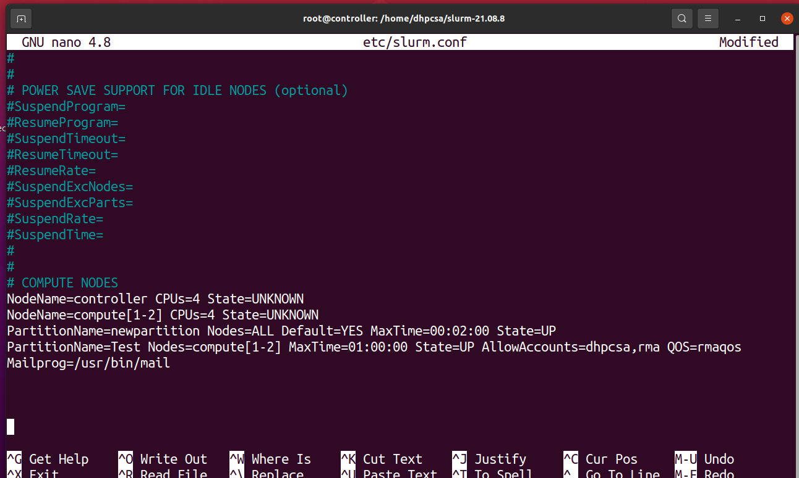
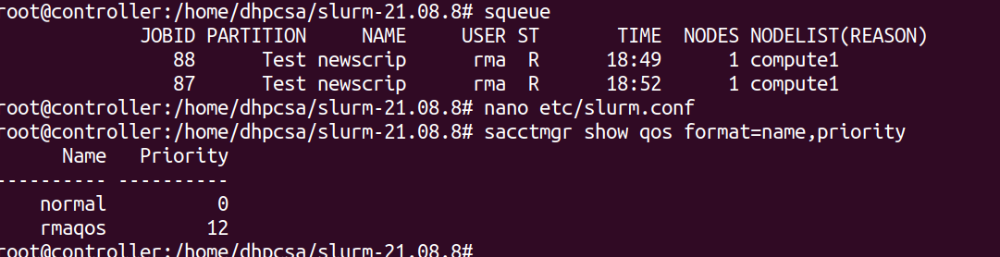
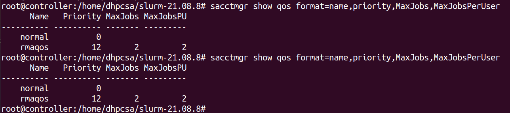
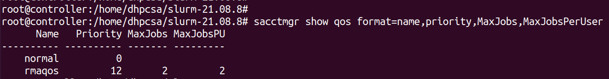
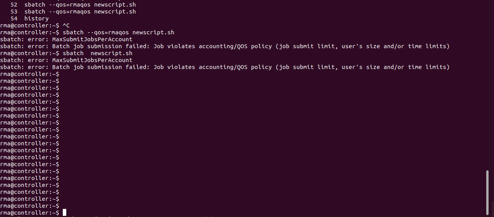

# Slurm_QOS_Implementation


## *In the previous setup, we configured Slurm with one controller and two compute nodes. In that environment, we carried out QoS management. Before implementing this, make sure all services are functioning correctly.*


#### *In SLURM (Simple Linux Utility for Resource Management), Quality of Service (QoS) allows administrators to define policies that control the allocation of resources based on job or user characteristics. Specifically, you can set limits like MaxJobsPerUser, MaxSubmitJobsPerUser, and MaxJobsPerAccount to manage job submissions and execution limits for users or accounts.*


## Objective
###  We want to configure QoS in SLURM to:
  - Limit the number of jobs that a user can run concurrently (MaxJobsPerUser).
  - Limit the number of jobs a user can submit (MaxSubmitJobsPerUser).
  - Limit the number of jobs that can be submitted by an account (MaxSubmitJobsPerAccount).
  - Limit the number of jobs running in an account (MaxJobsPerAccount).

<br>

## Step-by-Step implementation to Configure QoS in SLURM:

<br>

### Step 1: Understanding Key QoS Parameters
  - We will need to configure the following parameters in SLURM’s QoS settings:
- MaxJobsPerUser: The maximum number of jobs that can be running for a user at any given time.
  
- MaxSubmitJobsPerUser: The maximum number of jobs that a user can submit at once (not necessarily running).
  
- MaxJobsPerAccount: The maximum number of jobs that can be running for a specific account at any given time.
  
- MaxSubmitJobsPerAccount: The maximum number of jobs that can be submitted by a particular account.
    - These parameters can be set at the user, account, or QoS level depending on how your SLURM system is structured.
 


### Step 2: Add a New User:

  - Create a user account i.e rma.
- Commands:

```yml

useradd rma

passwd rma

mkdir /home/rma

chown rma:rma /home/rma/

chmod 755 /home/rma/

usermod -d /home/rma/ rma

usermod -s /bin/bash rma


```

### Step 2.1: Add a New User to Sudoers File:

 - Step: Open the sudoers file to allow rma to execute administrative commands.
```yml
nano /etc/sudoers
```


### Step 3:  Configure Slurm Quality of Service (QOS):

  - Create a new QOS (rmaqos) with a priority of 12 and set limits.

```yml

sacctmgr create qos rmaqos

sacctmgr modify qos rmaqos set priority=12

sacctmgr modify qos rmaqos set MaxJobs=2

sacctmgr modify qos rmaqos set MaxJobsPerUser=2

sacctmgr modify qos rmaqos set MaxSubmitJobsPerAccount=4

sacctmgr modify qos rmaqos set  MaxJobsPerAccount=10

sacctmgr modify qos rmaqos set MaxSubmitJobsPerAccount

sacctmgr show qos format=name,priority,MaxJobsPerUser

sacctmgr modify user rma set QOS=rmaqos


```


  - sacctmgr create qos rmaqos: This command creates a new Quality of Service (QoS) named rmaqos.

  - sacctmgr modify qos rmaqos set priority=12: This sets the priority of the rmaqos QoS to 12.

  - sacctmgr modify qos rmaqos set MaxJobs=2: This sets the maximum number of jobs that can run concurrently under the rmaqos QoS to 2.

  - sacctmgr modify qos rmaqos set MaxJobsPerUser=2: This limits each user under the rmaqos QoS to running 2 jobs concurrently.

  - sacctmgr modify qos rmaqos set MaxSubmitJobsPerAccount=4: This sets the maximum number of job submissions per account under the rmaqos QoS to 4.

  - sacctmgr modify qos rmaqos set MaxJobsPerAccount=10: This sets the maximum number of jobs per account under the rmaqos QoS to 10.

  - sacctmgr show qos format=name,priority,MaxJobsPerUser: This command displays information about QoS including its name, priority, and maximum jobs per user in a formatted output.

  - sacctmgr modify user rma set QOS=rmaqos: This command assigns the rmaqos QoS to the user rma.


### Step 4: Edit slurm.conf File:
  -  Modify the slurm.conf file to set up priorities and node states.

```yml
nano /etc/slurm/slurm.conf
```

  *Add this*

  ```yml

# Slurm Configuration for a Cluster with One Controller and Two Compute Nodes

# JOB PRIORITY
PriorityType=priority/multifactor
PreemptType=preempt/qos
PreemptMode=suspend,gang
# This sets job priority based on multifactor criteria, allows job preemption based on QoS, and suspends jobs if needed.

# LOGGING AND ACCOUNTING
AccountingStorageEnforce=limits,qos
# Ensures that accounting storage follows QoS limits.

# COMPUTE NODES
NodeName=controller CPUs=4 State=UNKNOWN
NodeName=compute[1-2] CPUs=4 State=UNKNOWN
# Defines the controller and two compute nodes, each with 4 CPUs and initially in an UNKNOWN state.

# PARTITIONS
PartitionName=newpartition Nodes=ALL Default=YES MaxTime=00:02:00 State=UP
PartitionName=Test Nodes=compute[1-2] MaxTime=01:00:00 State=UP AllowAccounts=dhpcsa,rma
# Creates two partitions: `newpartition` covering all nodes, with a maximum job time of 2 minutes, and `Test` with compute nodes only, a maximum time of 1 hour, and allows specific user accounts.

# QUALITY OF SERVICE (QoS)
QOS=rmaqos
# Defines a QoS for job prioritization.

# NOTIFICATIONS
Mailprog=/usr/bin/mail
# Sets the mail program for job notifications.


```


### Step 5: Copy Slurm Configuration Files to required places and then Restart Slurm Services.


```yml

cp slurm.conf /etc/slurm

cp slurm.conf /etc/slurm-llnl/
```

### Step 5.1:Copy Slurm Configuration to Compute Nodes also:

  - Use scp to transfer the Slurm configuration file to a compute nodes:

```yml
scp -r /etc/slurm.conf dhpcsa@compute1:/tmp/   # in my case
```

- Restart Slurm Control Daemons

```yml

systemctl restart slurmd

systemctl restart slurmctld

systemctl restart slurmdbd

```


### Step 6: Login as rma user and Set Up Path:

  - *Like this in my case:*
```yml
dhpcsa@controller:/etc$ su - rma
Password:
```

  - *Run this as it is*

```yml


export PATH="/home/dhpcsa/slurm-21.08.8/bin/:$PATH"
export PATH="/home/dhpcsa/slurm-21.08.8/sbin/:$PATH"
export LD_LIBRARY_PATH="/home/dhpcsa/slurm-21.08.8/lib:$LD_LIBRARY_PATH"
`

```

### Step 7: Verify Computes Nodes are Idle: 
  - use this

```yml
rma@controller:~$ sinfo
```
  - *You get like this*

```yml

# In my case

PARTITION AVAIL TIMELIMIT NODES STATE NODELIST
newpartition* up 2:00 3 idle compute[1-2],controller
Test up 1:00:00 2 idle compute[1-2]

```


### Step 8: Submit a Job with sbatch:
  - Create a new script (newscript.sh) and submit it using sbatch.

```yml

nano newscript.sh
```


  - *Add this as Example*


```yml

#!/bin/bash
#SBATCH --output=/tmp/fibonacci_%j.out
#SBATCH --error=/tmp/fibonacci_%j.err
#SBATCH --nodelist=compute1
#SBATCH --partition=Test
for i in {1..1000}
do
echo $i
sleep 4
done

```

### Step 8:  Change permission and submit job:

```yml

chmod +x newscript.sh

sbatch --qos=rmaqos newscript.sh

squeue       # check status of job

```


  - chmod +x newscript.sh: Makes the script executable.

  - sbatch --qos=rmaqos newscript.sh: Submits the script with the rmaqos QoS policy.

  - squeue: Displays the job queue status.


<br>
<br>

## Example for MaxJobs QOS

### 1. Create Account and User in sacctmgr
 - Create an account for examuser:

```yml
sacctmgr add account rma --immediate
```
 ### Create the user:

```yml
sacctmgr create user rma defaultaccount=examuser --immediate
```

### 2. Create QoS for the User
 - Create QoS (Quality of Service) for examuser:

``` yml
sacctmgr create qos rmaqos
```
 ### Set priority for examuser:

```yml
sacctmgr modify qos rmaqos set priority=12
```


### 3.. Modify User Settings (MaxJobs)
 - To modify the MaxJobs limit for the user examuser:

```yml
sudo sacctmgr modify user rma set MaxJobs=2
```


### 4. Check QoS Settings
 - To verify the QoS settings:
```yml
sacctmgr show qos format=name,priority,MaxJobs
```


### Step 9: For verification 


- sacctmgr show assoc format=cluster,user,qos: Lists the associations between clusters, users, and QoS settings.

- sacctmgr show users format=Name,qos: Displays user names along with their associated QoS settings.

- sacctmgr show users: Displays all users and their configurations.

- sacctmgr show accounts: Displays detailed information about user accounts and their resource limits.


- sacctmgr show qos format=name,priority,MaxJobs,MaxJobsPerUser,MaxSubmitJobsPerUser,MaxJobsPerAccount,MaxSubmitJobsPerAccount:-This command displays the names, priorities, maximum jobs, maximum jobs per user, maximum job submissions per user, maximum jobs per account, and maximum job submissions per account for each QoS setting.


<br>
<br>


## ------------------Screnshots--------------------
1.
<br>
<br>




2.
<br>
<br>





<br>
<br>

3.
<br>
<br>




4.
<br>
<br>





5.
<br>
<br>




6.
<br>
<br>


7.
<br>
<br>




8.We can see, Error is occurs when we exceeds the limit of job submission i.e 2 in our case-
<br>
<br>




<br>
<br>


<br>
<br>
<br>
<br>


**👨‍💻 𝓒𝓻𝓪𝓯𝓽𝓮𝓭 𝓫𝔂**: [Suraj Kumar Choudhary](https://github.com/Surajkumar4-source) | 📩 **𝓕𝓮𝓮𝓵 𝓯𝓻𝓮𝓮 𝓽𝓸 𝓓𝓜 𝓯𝓸𝓻 𝓪𝓷𝔂 𝓱𝓮𝓵𝓹**: [csuraj982@gmail.com](mailto:csuraj982@gmail.com)


<br>
